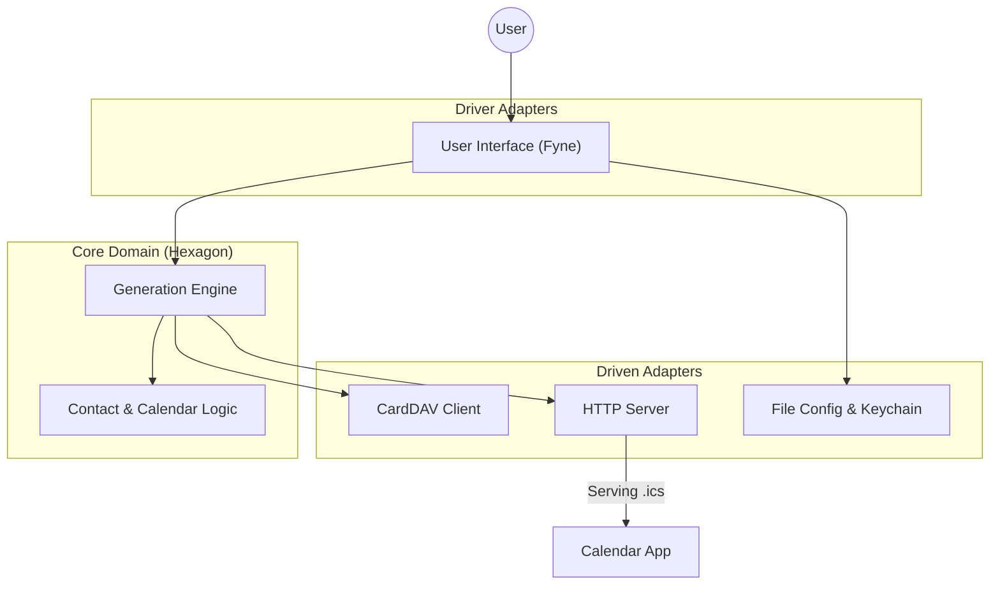

# Go Birthday 🎂


**Go Birthday** is a high-performance, privacy-first local bridge between your contacts (CardDAV or vCard files) and your calendar software.

It was designed to solve a persistent annoyance in digital calendars: **Timezone Shifting**. By generating a strictly compliant iCalendar (`.ics`) feed with "Floating Dates", birthdays remain on the correct day, regardless of where you are in the world or where the contact was created.

> **Note:** This project was realized with the assistance of **Google Gemini Pro**. It serves as a practical example of modern Go application development, Hexagonal Architecture, and cross-platform GUI implementation.

---

## ✨ Key Features

* **Universal Compatibility:** Works with any CardDAV server (Nextcloud, iCloud, Synology, Fastmail) or local `.vcf` files.
* **Floating Dates (RFC 5545):** Uses the iCal `VALUE=DATE` standard. A birthday on March 5th stays on March 5th, whether you are in Tokyo, Paris, or New York.
* **Privacy First:**
    * All processing is done locally in memory (RAM).
    * Credentials are stored in the OS secure keychain (Windows Credential Manager, macOS Keychain, Linux Secret Service).
    * Logs are stored locally with strict `0700` permissions.
* **High Performance:**
    * Built with **Go**.
    * **Lock-Free Server:** The internal HTTP server uses `atomic.Pointer` for thread-safe, non-blocking reads.
    * Low memory footprint (~15 MB).
* **Modern UI:** System tray integration and a clean settings window built with [Fyne](https://fyne.io).

---

## 🛠 Architecture & Technical Choices

This project is built strictly following **Hexagonal Architecture** (also known as Ports and Adapters or Clean Architecture). This ensures that the core logic is independent of the user interface and the web server, making the code testable and maintainable.

### The Hexagon (Core Domain)

The heart of the application lives in `internal/engine`.
* **Pure Logic:** It does not know about the GUI (Fyne) or the HTTP Server.
* **Responsibilities:** vCard parsing, leap year calculations (handling Feb 29th logic), and deterministic UID generation.
* **Dependency Injection:** It relies on interfaces (e.g., `Clock`, `Fetcher`) rather than concrete implementations, allowing for easy unit testing.

### The Adapters

1.  **Driver Adapter (The UI):** Located in `internal/ui`. It uses the **Fyne** toolkit to render the settings window and system tray icon. It "drives" the engine by updating the configuration.
2.  **Driven Adapter (The Server):** Located in `internal/server`. It serves the generated `.ics` file to your calendar client.
3.  **Driven Adapter (The Config):** Located in `internal/config`. Manages persistence and OS-specific paths.

### Visual Overview



### Technical Highlights

* **Concurrency:** The HTTP server is designed to be **lock-free** for readers. When a sync occurs, the engine generates a new blob of data and atomically swaps the pointer. This prevents the UI from freezing the HTTP server during updates.
* **CGO & Graphics:** The project uses CGO because the Fyne GUI toolkit relies on the system's graphics drivers (OpenGL) for hardware acceleration.
* **Testing:** The project includes `integrity_test` and `race` detection to ensure data stability.

---

## 🚀 Installation

### Pre-compiled Binaries
Check the [Releases](https://github.com/tartampluch/go-birthday/releases) page for the latest version.

### ⚠️ Security Notice (Unsigned Binary)
As this is an open-source project, the binaries are not digitally signed with a paid certificate.
* **Windows:** If SmartScreen appears, click **More info** > **Run anyway**.
* **macOS:** If Gatekeeper blocks the app, Right-Click the icon > **Open**.

---

## 📥 Download

Download the latest version for your operating system:

| OS | Architecture | Download Link |
| :--- | :--- | :--- |
| **Windows** | 64-bit (Intel/AMD) | [📥 Download go-birthday-windows-amd64.zip](https://github.com/tartampluch/go-birthday/releases/latest/download/go-birthday-windows-amd64.zip) |
| **Windows** | ARM64 (Snapdragon/Surface) | [📥 Download go-birthday-windows-arm64.zip](https://github.com/tartampluch/go-birthday/releases/latest/download/go-birthday-windows-arm64.zip) |
| **macOS** | Apple Silicon (M1/M2/M3/M4) | [📥 Download go-birthday-darwin-arm64.zip](https://github.com/tartampluch/go-birthday/releases/latest/download/go-birthday-darwin-arm64.zip) |
| **macOS** | Intel | [📥 Download go-birthday-darwin-amd64.zip](https://github.com/tartampluch/go-birthday/releases/latest/download/go-birthday-darwin-amd64.zip) |
| **Linux** | 64-bit (Intel/AMD) | [📥 Download go-birthday-linux-amd64.zip](https://github.com/tartampluch/go-birthday/releases/latest/download/go-birthday-linux-amd64.zip) |
| **Linux** | ARM64 (Raspberry Pi/Servers) | [📥 Download go-birthday-linux-arm64.zip](https://github.com/tartampluch/go-birthday/releases/latest/download/go-birthday-linux-arm64.zip) |

> *Looking for older versions or changelogs? Visit the [Releases page](https://github.com/tartampluch/go-birthday/releases).*

---

## 🏗 Building from Source

To build this project, you need a Go environment and a C compiler (required for the GUI).

### Prerequisites

1.  **Go 1.25+**: Ensure `go version` returns a compatible version.
2.  **C Compiler**:
    * **Windows**: TDM-GCC or MinGW64.
    * **macOS**: Xcode Command Line Tools (`xcode-select --install`).
    * **Linux**: GCC (`sudo apt install build-essential` or equivalent).
3.  **Go Winres** (Optional, for Windows icons):
    * Install via: `go install github.com/tc-hib/go-winres@latest`

### Automated Build (Recommended)

We provide scripts that handle version injection, resource embedding, and flag optimization.

#### 🪟 Windows (PowerShell)

Run the provided PowerShell script. It generates a GUI-mode binary (no console window) with the icon embedded.

```powershell
.\build.ps1
```
> *Output:* `go-birthday.exe`

#### 🍎 macOS / 🐧 Linux (Makefile)

Use the Makefile to build the binary.

```bash
make build
```
> *Output:* `go-birthday`

### Manual Build

If you prefer to run the commands yourself:

1.  **Generate Resources:**
    ```bash
    go generate ./...
    ```
2.  **Build (Production flags):**
    The `-ldflags` are used to strip debug symbols (`-s -w`) and, on Windows, to hide the console (`-H windowsgui`).

    **Windows:**
    ```bash
    go build -ldflags "-H windowsgui -s -w" -o go-birthday.exe ./cmd/go-birthday
    ```

    **macOS / Linux:**
    ```bash
    go build -ldflags "-s -w" -o go-birthday ./cmd/go-birthday
    ```

---

## ⚙️ Usage

1.  **Start the App:** A cake icon 🎂 will appear in your system tray.
2.  **Configure:** Right-click the icon and select **Settings**.
    * **Source:** Choose 'Local File' or 'CardDAV URL'.
    * **Reminders:** Set up optional notifications (e.g., 1 day before or 9 hours after start of day).
3.  **Subscribe:** Add the local calendar URL to your calendar application (Outlook, Thunderbird, Apple Calendar, etc.):
    ```text
    http://127.0.0.1:18080/go-birthday.ics
    ```

---

## 🧪 Testing

The project maintains a high standard of code quality with extensive unit tests covering:
* **Edge Cases:** Leap years (Feb 29), missing years, invalid dates.
* **Concurrency:** Race condition detection in the HTTP server.
* **Network:** Mocked fetchers for CardDAV interactions.

To run the full test suite with race detection:

```bash
go test -v -race -cover ./...
```

---

## 📜 License

This project is released under **The Unlicense**.

This means the code is in the **public domain**. You can use, copy, modify, merge, publish, distribute, sublicense, and/or sell copies of the software without any restriction.

For more details, see the `LICENSE` file.

---

*Generated with ❤️ and 🤖 (Gemini Pro)*
